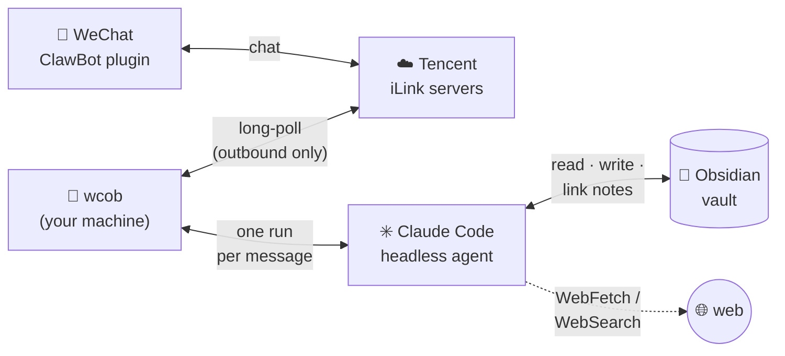

# wechat-claude-obsidian-bot

**Your Obsidian vault, reachable from WeChat.** Message a bot from your
phone — a thought, a link, a photo, a voice memo, a question — and a
headless [Claude Code](https://code.claude.com) agent running on your own
machine does the right thing with it: files a well-linked note, fetches
and summarizes the link, teaches you something building on what your vault
already knows, or researches the web — then replies in the chat.

It rides Tencent's official
[iLink / 微信ClawBot](https://github.com/hao-ji-xing/openclaw-weixin/blob/main/weixin-bot-api.md)
protocol (via [weixin-ilink](https://github.com/zongrongjin/weixin-ilink)),
so no WeChat account is put at risk, and your machine only makes
*outbound* connections — no webhook, no domain, no exposed server.



How a message travels:

1. You chat with the bot in WeChat; Tencent's iLink servers relay it.
2. `wcob` picks it up by long-polling, saves any media into the vault, and
   starts a headless Claude Code run with the vault as working directory —
   so your vault's `CLAUDE.md` conventions load automatically. Messages
   sent shortly after one another share a session, so follow-ups like
   "actually file that under Economics" just work.
3. The agent reads, writes, and links notes (and hits the web when
   needed), then its reply travels back the same path to your phone, with
   the run's cost appended.

## Requirements

- A mainland-China (+86) WeChat account with the 微信ClawBot plugin
  (设置 → 插件 → 微信ClawBot; gray release, iOS ≥ 8.0.70 / Android ≥ 8.0.68).
  International WeChat is not supported by Tencent yet.
- Python ≥ 3.11 and the [Claude Code CLI](https://code.claude.com)
  installed and authenticated (subscription login or `ANTHROPIC_API_KEY`).

## Setup

The quick way — clone and run the guided installer. It checks Python and
the Claude CLI (offering to install/log in), installs the package into
`./.venv`, writes your config, runs the QR pairing, and can set up a
systemd user service. Idempotent; re-run it anytime:

```sh
git clone https://github.com/WilsonZheng0327/wechat-claude-obsidian-bot
cd wechat-claude-obsidian-bot && ./setup.sh
```

Or manually:

```sh
pipx install git+https://github.com/WilsonZheng0327/wechat-claude-obsidian-bot
# from a checkout: pip install .
# with local voice transcription (small Whisper model): pip install ".[voice]"
```

Run `wcob` once — it creates a commented
`~/.config/wechat-claude-obsidian-bot/config.toml` (every setting is
documented there); set `vault` to your vault's path (or just
`export WCOB_VAULT=~/YourVault`). Then:

```sh
wcob login  # scan the QR with the phone that has ClawBot enabled
wcob        # run the bot (checks your Claude CLI login at startup)
wcob echo   # plumbing test without Claude — just echoes
```

Credentials land in `~/.local/share/wechat-claude-obsidian-bot/creds.json`;
anyone with that file can act as your bot — keep it private.

## Using it

| You send | The bot |
|---|---|
| A thought | Files a well-linked note where it belongs. |
| A link | Fetches it, writes a summary note. |
| A question | Answers it (researching the web if needed) — no note unless it's worth keeping. |
| "teach me X" | A short lesson built on your existing notes, then captures it as notes. |
| Voice | Same, from WeChat's transcript (or local Whisper with the `[voice]` extra). |
| Image / file | Saves it in `<vault>/Wechat_Saved/`, views/reads it, writes a note embedding it. Media over `max_media_mb` (default 50) is refused. |
| Video | Declined — the agent can't watch them. |

**Follow-ups work.** Messages within `session_window_minutes` of the last
one (default 15; 0 disables) continue the same agent session — send a
photo, then "put that in my Travel notes". After a longer gap, the next
message starts fresh.

**Commands** — answered instantly by the bot itself, no agent run:

- `/status` (`/settings`, `/config`, `/状态`, `/设置`) — model, language,
  vault, session state, file locations.
- `/new` (`/reset`, `/新会话`) — the next message starts fresh.
- `/help` (`/帮助`)

Anything else starting with `/` goes to the agent as normal text. The
agent has matching tools, so natural language works too ("what model are
you on?", "start over") — at the cost of a run. It can also send vault
content back with its `send_file`/`send_image` tools: "send me the Docker
note as a file", "show me that diagram from last week".

## Customizing

The agent's standing instructions live in
`~/.config/wechat-claude-obsidian-bot/prompt.md`, seeded on first run from
the packaged default (English or Chinese, per `language`). Change them two
ways:

- **Edit the file** — plain Markdown, re-read on every message.
- **Tell the bot** — "from now on, reply in Chinese", "put links under
  Reading/" — it records the preference in its own prompt file and
  confirms. Undo by telling it so.

`settings.toml` (same directory) holds the machine-readable pair: `model`
(`"default"`, an alias like `haiku`/`sonnet`/`opus`, or a full model id)
and `language` (`"en"`/`"zh"`, switches agent replies and built-in
messages). Same deal — edit it, or just ask: "switch to haiku", "说中文".

Vault-side conventions (folders, wikilinks, note format) belong in the
*vault's* `CLAUDE.md`, which the agent loads automatically; without one it
writes sensible, well-linked Markdown.

## Costs & housekeeping

Each message is one headless agent run (capped at 40 turns / $1); the
reply shows the run's cost and turn count. On subscription auth the cost
is notional (it draws on your plan's usage limits); with
`ANTHROPIC_API_KEY` it's a real charge. Simple captures run a few cents.

The bot's own state is tiny (`creds.json`, polling cursor, `session.json`).
What grows: agent transcripts under `~/.claude/projects/` (Claude Code
deletes them after 30 days by default) and `<vault>/Wechat_Saved/` (prune
like any vault folder). The Whisper model (~250 MB) is a one-time download.
Logs go to stdout — rotation is your process manager's job.
