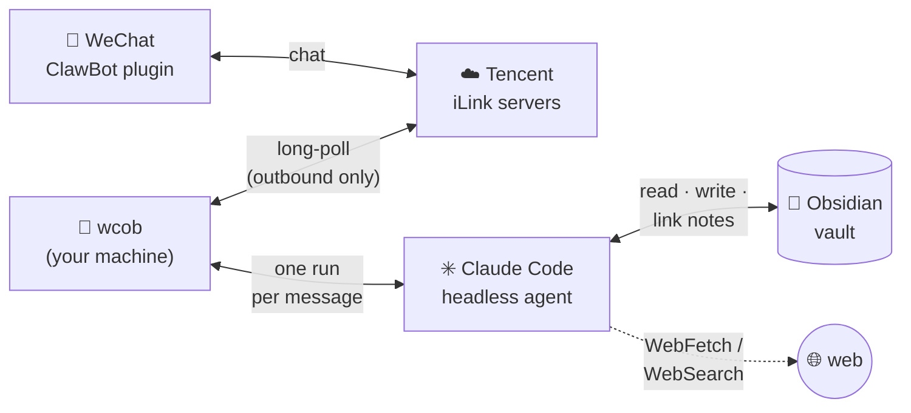

# wechat-claude-obsidian-bot

**Your Obsidian vault, reachable from WeChat.** Message a bot from your
phone — a thought, a link, a photo, a voice memo, a question — and a
headless [Claude Code](https://code.claude.com) agent running on your own
machine does the right thing with it: files a well-linked note, fetches
and summarizes the link, teaches you something building on what your vault
already knows, or researches the web — then replies in the chat.

It rides Tencent's official
[iLink / 微信ClawBot](https://github.com/hao-ji-xing/openclaw-weixin/blob/main/weixin-bot-api.md)
protocol (via [weixin-ilink](https://github.com/zongrongjin/weixin-ilink)),
so no WeChat account is put at risk, and your machine only makes
*outbound* connections — no webhook, no domain, no exposed server.



How a message travels:

1. You chat with the bot in WeChat; Tencent's iLink servers relay it.
2. `wcob` picks it up by long-polling, saves any media into the vault, and
   starts a headless Claude Code run with the vault as working directory —
   so your vault's `CLAUDE.md` conventions load automatically. Messages
   sent shortly after one another share a session, so follow-ups like
   "actually file that under Economics" just work.
3. The agent reads, writes, and links notes (and hits the web when
   needed), then its reply travels back the same path to your phone, with
   the run's cost appended.

## Requirements

- A mainland-China (+86) WeChat account with the 微信ClawBot plugin
  (设置 → 插件 → 微信ClawBot; gray release, iOS ≥ 8.0.70 / Android ≥ 8.0.68).
  International WeChat is not supported by Tencent yet.
- Python ≥ 3.11.
- **A model.** Either the [Claude Code CLI](https://code.claude.com)
  (subscription login or `ANTHROPIC_API_KEY`) — the default — *or* an API key
  for any other provider (OpenAI, Gemini, …). You pick during setup.

## Setup

The quick way — clone and run the guided installer. It creates `./.venv`,
installs the Claude CLI if you pick Claude, then opens a **full-screen setup
wizard** (`wcob setup`) where you choose the backend, add API keys (each
tested before saving), pick the default model, and set your vault. Back in
the terminal it installs the matching backend, runs the QR pairing, and can
set up a systemd user service. Idempotent; re-run it anytime:

```sh
git clone https://github.com/WilsonZheng0327/wechat-claude-obsidian-bot
cd wechat-claude-obsidian-bot && ./setup.sh
```

To revisit the config later — switch backend, add a key, change model or
vault — run the wizard on its own with `wcob setup`.

Or manually. The base package ships **neither backend** — install with the
extra for the one you want (and, for the API backend, your provider):

```sh
# Claude backend — also install the `claude` CLI: https://code.claude.com
pipx install "wechat-claude-obsidian-bot[claude] @ git+https://github.com/WilsonZheng0327/wechat-claude-obsidian-bot"

# API backend — add your provider extra: api-openai / api-google / api-anthropic
pipx install "wechat-claude-obsidian-bot[api,api-openai] @ git+https://github.com/WilsonZheng0327/wechat-claude-obsidian-bot"

# from a checkout, same extras:  pip install '.[claude]'  or  pip install '.[api,api-openai]'
```

Then point it at your vault. The first `wcob run-*` with no vault set writes
a commented `config.toml` (every setting is documented there) and stops so
you can fill it in; set `vault` to your vault's path (or just
`export WCOB_VAULT=~/YourVault`). From a checkout it lands in **`config/`**,
next to the code, alongside `prompt.md` and `settings.toml`; a plain
`pipx`/`pip` install uses `~/.config/wechat-claude-obsidian-bot/` instead.
Either way `WCOB_CONFIG` overrides the location, and relative paths inside
`config.toml` are relative to that file. Your WeChat credentials always stay
out of the checkout, in `~/.local/share/wechat-claude-obsidian-bot/`. Then:

```sh
wcob login       # scan the QR with the phone that has ClawBot enabled
wcob run-claude  # run on Claude (bare `wcob` also works)
wcob run-api     # run on any other provider (needs a key in secrets.env)
wcob echo        # plumbing test without an agent — just echoes
```

`setup.sh` picks the right `run-*` for you and seeds the model. Switch models
later without restarting the process by messaging `/model` (see below); switch
*backends* by stopping and starting the other `run-*` command.

Credentials land in `~/.local/share/wechat-claude-obsidian-bot/creds.json`;
anyone with that file can act as your bot — keep it private.

## Using it

| You send | The bot |
|---|---|
| A thought | Files a well-linked note where it belongs. |
| A link | Fetches it, writes a summary note. |
| A question | Answers it (researching the web if needed) — no note unless it's worth keeping. |
| "teach me X" | A short lesson built on your existing notes, then captures it as notes. |
| Voice | Same, from WeChat's own transcript. If WeChat sends none, the bot asks you to type it — it doesn't transcribe audio itself. |
| Image / file | Saves it in `<vault>/Wechat_Saved/`, views/reads it, writes a note embedding it. Media over `max_media_mb` (default 50) is refused. |
| Video | Declined — the agent can't watch them. |

**Follow-ups work.** Messages within `session_window_minutes` of the last
one (default 15; 0 disables) continue the same agent session — send a
photo, then "put that in my Travel notes". After a longer gap, the next
message starts fresh.

**Scheduling.** Ask in plain language and the bot runs a task later — once
or on a repeat — and messages you the result: "in two hours, remind me to
call the dentist", "every weekday at 8am, summarize the notes I added
yesterday and flag open questions". One-time and recurring are both
supported, and the store is kept as **history** — a one-time task stays
listed (marked done) after it fires rather than vanishing. Times use the
bot machine's local timezone. `/schedules` lists everything (pending,
recurring, and past); `/unschedule <id>` cancels one. Scheduled runs use a
fresh session, so they never disturb your live conversation.

**Commands** — answered instantly by the bot itself, no agent run:

- `/status` (`/settings`, `/config`, `/状态`, `/设置`) — model, language,
  vault, session state, file locations.
- `/model [name]` (`/模型`) — show or switch the model. On the API backend it
  checks that the provider's key is in `secrets.env` first and refuses (without
  changing anything) if it's missing, telling you which key to add.
- `/new` (`/reset`, `/新会话`) — the next message starts fresh.
- `/schedules` (`/定时`) — list scheduled tasks, including past ones (history).
- `/unschedule <id>` (`/取消`) — cancel a scheduled task by its id.
- `/help` (`/帮助`)

Anything else starting with `/` goes to the agent as normal text. The
agent has matching tools, so natural language works too ("what model are
you on?", "start over") — at the cost of a run. It can also send vault
content back with its `send_file`/`send_image` tools: "send me the Docker
note as a file", "show me that diagram from last week".

If the vault is already a git repo, the agent may also run git in it
(status/diff/log/add/commit/push/pull) — "commit my vault", "push my
notes". Pushing needs non-interactive auth (an SSH key or a credential
helper); the bot never turns a plain folder into a repo itself.

## Customizing

The agent's standing instructions live in `config/prompt.md` — or
`~/.config/wechat-claude-obsidian-bot/prompt.md` if you didn't install from a
checkout — seeded on first run from the packaged default (English or Chinese,
per `language`). Change them two ways:

- **Edit the file** — plain Markdown, re-read on every message.
- **Tell the bot** — "from now on, reply in Chinese", "put links under
  Reading/" — it records the preference in its own prompt file and
  confirms. Undo by telling it so.

`settings.toml` (same directory) holds the machine-readable settings, one
per backend so switching backends never clobbers the other's choice:
`model` for Claude (`"default"`, an alias like `haiku`/`sonnet`/`opus`, or a
full model id) and `api_model` for the API backend (a `provider:model`
string like `openai:gpt-5` or `google_genai:gemini-3-pro`), plus `language`
(`"en"`/`"zh"`, switches agent replies and built-in messages). Same deal —
edit it, or just ask: "switch to haiku", "说中文". Each backend reads only
its own field.

API keys for the `run-api` backend live in **`secrets.env`** at the repo
base (gitignored), as `OPENAI_API_KEY=…` / `GOOGLE_API_KEY=…` lines —
`setup.sh` writes it for you after testing each key, or add lines by hand.
`/model provider:model` checks the matching key is present before switching.

Vault-side conventions (folders, wikilinks, note format) belong in the
*vault's* `CLAUDE.md`, which the agent loads automatically; without one it
writes sensible, well-linked Markdown.

## Costs & housekeeping

Each message is one headless agent run, and the reply ends with a short
footer. On the **Claude** backend (capped at 40 turns / $1) it shows the
run's cost and turn count: on subscription auth the cost is notional (it
draws on your plan's usage limits); with `ANTHROPIC_API_KEY` it's a real
charge. Simple captures run a few cents. On the **API** backend the footer
shows tokens and turns instead, and every run is a real charge against that
provider's key.

The terminal running the bot logs each turn as it happens — the outgoing
request and model, every tool call, and a summary line (turns, tokens,
wall-clock, and cost on the Claude path) — handy for watching what the
agent does.

The bot's own state is tiny (`creds.json`, polling cursor, and the session
handle in `session.json`/`thread.json`). What grows: on the Claude backend,
agent transcripts under `~/.claude/projects/` (Claude Code deletes them
after 30 days by default); on the API backend, the LangGraph thread history
in `threads.db` beside `creds.json`; and `<vault>/Wechat_Saved/` on both
(prune like any vault folder). Logs go to stdout — rotation is your process
manager's job.
